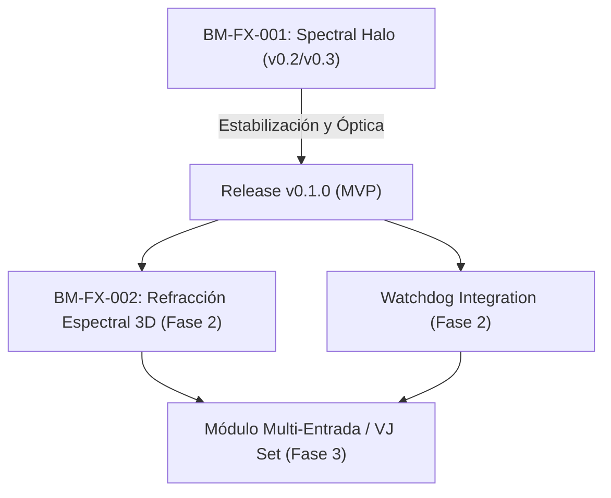

# Hoja de Ruta (Roadmap) - Ecosistema BM-FX

Este documento describe la visión de desarrollo y la evolución de los módulos visuales interactivos de **BlackMamba Records**.

---

## 🗺️ Fases del Proyecto

---

## 🟣 Fase 1: BM-FX-001 — Spectral Halo (Actual)
*Enfoque: Refinamiento de físicas de luz y automatización.*
- [x] Repositorio Git limpio e infraestructura Node.js.
- [x] Aplicación nativa Android usando Capacitor.
- [x] CLI de comandos `bm-fx` y servidor de presets API Express.
- [x] Configuración de CI/CD automatizada (GitHub Actions + GitHub Pages).
- [ ] **Física Óptica del Shader (v0.3):**
  - Implementación de refracción variable por frecuencias bajas en el cristal.
  - Simulación de patrones de difracción espectral fina en la apertura de los huecos.
  - Optimización de atenuación exponencial del Bloom.
- [ ] Lanzamiento del primer release oficial (`v0.1.0`).

---

## 🔵 Fase 2: BM-FX-002 — Refracción 3D & Watchdog Avanzado
*Enfoque: Profundidad tridimensional e interconectividad.*
- **BM-FX-002:** Desarrollo de un nuevo shader que implemente un toroide o esfera de cristal 3D usando Raymarching/Raytracing en tiempo real dentro del fragment shader.
- **Sincronización Avanzada (Watchdog 2.0):**
  - Implementación de WebSockets bidireccionales en el servidor Node.js.
  - Sincronización en tiempo real del progreso de la canción y espectro de audio entre la app nativa y múltiples pantallas externas (modo VJ).
- **Customización de Marca:** Generación automática de assets móviles para íconos y splash screen personalizados.

---

## 🟢 Fase 3: BlackMamba VJ Dashboard (Fase Futura)
*Enfoque: Consola de control unificada para directos.*
- Interfaz gráfica avanzada para control y transiciones entre múltiples módulos visuales (`BM-FX-001`, `BM-FX-002`, etc.).
- Soporte para entrada MIDI nativa que permita modular los parámetros del shader (velocidad, colores, refracciones) mediante controladores de hardware en vivo.
- Compilación de ejecutables de escritorio nativos (macOS/Windows) usando Electron o Tauri.
